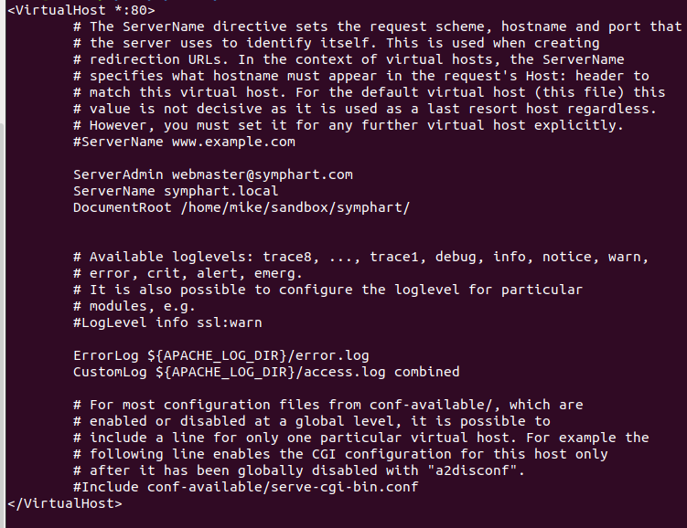
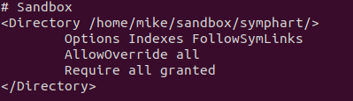
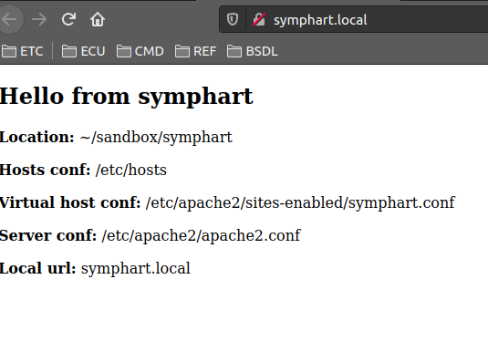

# Setting up a PHP project using Apache2 server

## Requirements:

1. PHP
2. Database?
3. Apache2
4. PHPMyAdmin?
5. Composer

## Steps

1. Create your local project inside your root directory ~/project_name ``mkdir project_name``
2. Setup your PHP project_name using composer ``cd project_name`` AND ``composer init``
3. Create your index file ``touch index.php``
4. Write a test input ``sudo nano index.php`` AND type inside``<?php echo "Hello world" ``
5. Save the file by pressing CTRL + X THEN Y and press return
6. Add your project_name to your hosts file ``sudo nano /etc/hosts`` AND type ``127.0.0.1 project_name.local`` 
7. Save changes by pressing CTRL + X THEN Y and press return
8. Copy 000-default.conf using ``sudo cp /etc/apache2/sites-enabled/000-default.conf /etc/apache2/sites-enabled/project_name.conf``
9. Replace the /etc/apache2/sites-enabled/project_name.conf content into this:

Change the symphart to your project_name

10. Save the changes by pressing CTRL + X THEN choose Y and return
11. Edit your apache2.conf and add your local project directory and settings ``sudo nano /etc/apache2/apache2.conf`` AND
add these lines    Change the symphart and use your own project_name.
    
12. Restart apache2 by just to make sure everything is working by ``sudo systemctl reload apache2``
13. Go to your web browser and go to your local project host url you have configured in your /etc/hosts file like symphart.local
14. If everything goes well, you should see a screen like this:

    
